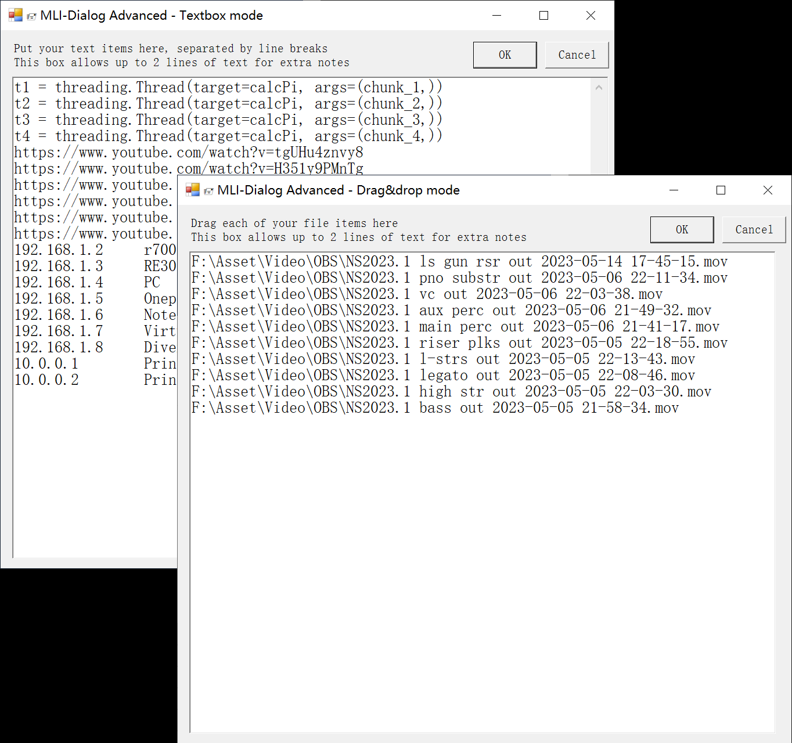

### An advanced & practical MultiLine Read-Host + MultiFile Drag-&-Drop Dialog, based on C# and PowerShell
- The solution to many user-interactivity problems where Bash, CMD, previously just can't deal with

- **Mode 1:** Text-Box multi-line Read-Host GUI - to allow users input multiple lines of text with ease
- **Mode 2:** List-Box multi-file Drag&drop GUI - to allow users to drag a bunch of files and get their full-path
  - `-InboxType "2"` OR `-InboxType "dnd"`
- Return-Type selection to whether get string or array output
  - `-ReturnType "str"` OR `-ReturnType "ary"`

#### Compatibility enhancements:
- √ Displays correctly on both Low & high DPI display
- √ Built-in empty-line scrubbing feature, only return valid lines
- √ Automatically scales window size according to monitor resolution
- √ Automatically compensates rendering error inbetween PowerShell Console & ISE
- √ Option to escape square brackes (\``[, \``]) so Functions like Get-Item, Get-ChildItem can still Function
  - `-FixSquareBrkts $true`, Default is $false
- √ User defined font size for textBox & listBox
  - `-FontSize <Int>`
- √ ESC key → Cancel key binding
- √ (List-Box Mode) DEL key → Remove selected item feature

[MultiLine-Input-Dialog-Advanced.ps1](MultiLine-Input-Dialog-Advanced.ps1)

Support...me...

